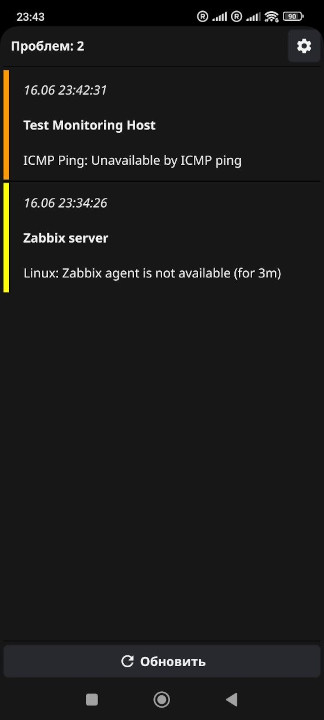
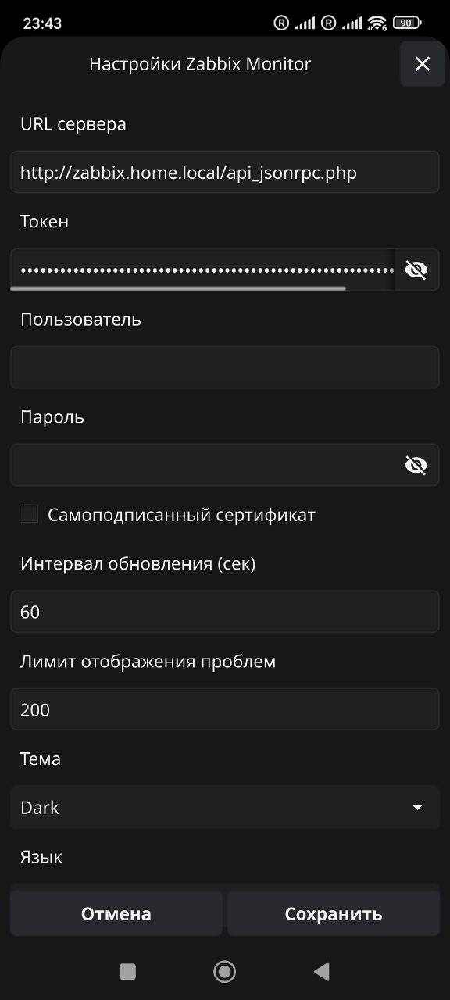

####  Zabbix Android API Client 
------

**Версия App**
```text
v0.6.0
```

**Версия Go**
```text
1.24.6
```

**Сборка Fyne**
```text
go install github.com/fyne-io/fyne-cross@latest

fyne-cross android -app-version 0.6.0 -app-id com.zabbix.android.monitor -icon icon.png
```

**Приложение для Android**
- Нужно сгенерировать на стороне сервера Token
- Можно получать текущие проблемы

<br>

<table>
  <tr>
    <td></td>
    <td></td>
  </tr>
</table>
